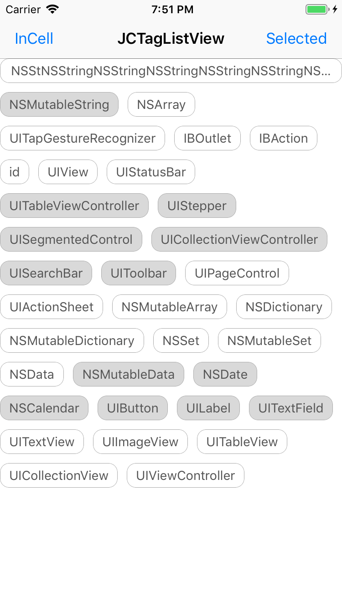
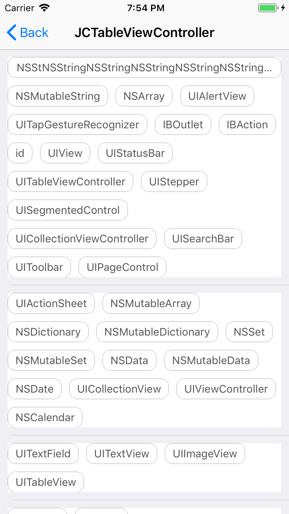

# JCTagListView

[](https://cocoapods.org/pods/FMDBHelper)
[](https://cocoapods.org/pods/JCTagListView)
[](https://cocoapods.org/pods/JCTagListView)
[](https://cocoapods.org/pods/JCTagListView)

 
 
 

## Example

To run the example project, clone the repo, and run `pod install` from the Example directory first.

## Installation

JCTagListView is available through [CocoaPods](https://cocoapods.org). To install 
it, simply add the following line to your Podfile:

```ruby
pod 'JCTagListView', '2.0.0'
```

## Usage

```objc
IB_DESIGNABLE
@interface JCTagListView : UIView

@property (nonatomic, assign) IBInspectable CGFloat tagItemSpacing; // default: 10
@property (nonatomic, assign) IBInspectable CGFloat tagLineSpacing; // default: 10
@property (nonatomic, assign) IBInspectable CGFloat tagCornerRadius; // default: 10
@property (nonatomic, assign) IBInspectable CGFloat tagBorderWidth; // default: 0.5

@property (nonatomic, assign) UIEdgeInsets tagContentInset; // default: 5､ 10､ 5､ 10

@property (nonatomic, strong) UIColor *tagBorderColor; // default: lightGrayColor
@property (nonatomic, strong) UIColor *tagSelectedBorderColor; // default: lightGrayColor
@property (nonatomic, strong) UIColor *tagTextColor; // default: darkGrayColor
@property (nonatomic, strong) UIColor *tagSelectedTextColor; // default: darkGrayColor
@property (nonatomic, strong) UIColor *tagBackgroundColor; // default: whiteColor
@property (nonatomic, strong) UIColor *tagSelectedBackgroundColor; // default: rgb(217,217,217)

@property (nonatomic, assign) BOOL supportSelected; // default: NO
@property (nonatomic, assign) BOOL supportMultipleSelected; // default: NO

@property (nonatomic, strong) UIFont *tagFont; // default: [UIFont systemFontOfSize:14.0f]

@property (nonatomic, strong) NSArray<NSString *> *tags;
@property (nonatomic, strong) NSMutableArray<NSString *> *selectedTags;
@property (nonatomic, strong, readonly) NSMutableArray<NSNumber *> *selectedTagsIndex; // selected result

@property (nonatomic, assign, readonly) CGFloat contentHeight; // Used to calculate the height

- (void)didSelectItem:(JCTagListViewBlock)block;

- (void)reloadData;

@end
```

## Author

李京城

## License

JCTagListView is available under the MIT license. See the LICENSE file for more info.
